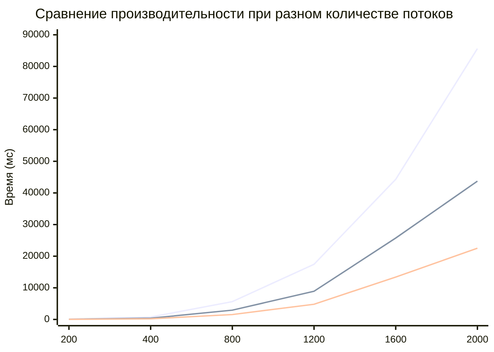

# Лабораторная работа №5 студента группы 6213 Болдырева Дениса

**Лабараторная работа выполнялась на суперкомпьютере "Сергей Королев". Запуск и получения результататов происходили путем последовательного выполнения команд записанных в файле commands.txt.**

## Таблица измерений (число ядер - 8)

| № замера | Размер матрицы | Время перемножения, мс |
|:----------:|:----------------:|:------------------------:|
|**Число потоков - 2**|
| 2.1 | 200 | 98 |
| 2.2 | 400 | 760 |
| 2.3 | 800 | 5630 |
| 2.4 | 1200 | 17439 |
| 2.5 | 1600 | 44302 |
| 2.6 | 2000 | 85630 |
|**Число потоков - 4**|
| 3.1 | 200 | 52 |
| 3.2 | 400 | 386 |
| 3.3 | 800 | 2934 |
| 3.4 | 1200 | 8909 |
| 3.5 | 1600 | 25738 |
| 3.6 | 2000 | 43722 |
|**Число потоков - 8**|
| 4.1 | 200 | 25 |
| 4.2 | 400 | 194 |
| 4.3 | 800 | 1546 |
| 4.4 | 1200 | 4801 |
| 4.5 | 1600 | 13403 |
| 4.6 | 2000 | 22514 |

### График: Зависимость времени от размера матрицы и количества потоков

**Вывод: скорость производительности возрастала примерно в два раза при каждом увеличении числа потоков. Пришлось адаптировать файлы 3 лабараторной работы в связи с особенностями компиляторов на суперкомпьютере.**