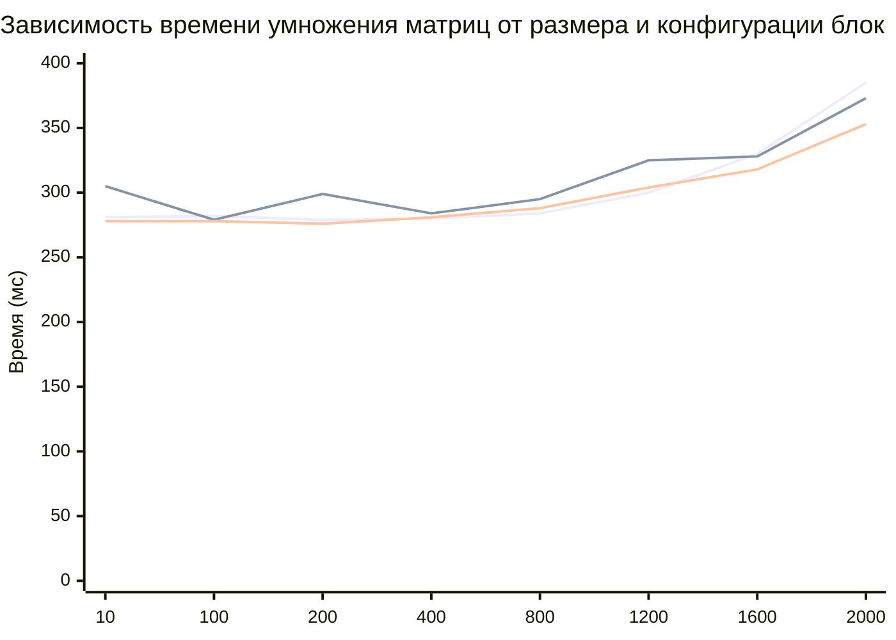

# Лабараторная работа №3 студента группы 6213 Болдырева Дениса:

**Исходная точка программы - lab4.ipynb. Работа велась с расшиением vs code и google colab, так как в пк отсутствуют cuda ядра. Так как google colab имеет ограничения по стеку пришлось использовать в класс std::vector.**

| № замера | Размер матрицы | Время перемножения, мс |
|:----------:|:----------------:|:------------------------:|
|**Размер блоков - 8х8**|
| 1.1 | 10 | 281 |
| 1.2 | 100 | 282 |
| 1.3 | 200 | 279 |
| 1.4 | 400 | 280 |
| 1.5 | 800 | 284 |
| 1.6 | 1200 | 300 |
| 1.7 | 1600 | 330 |
| 1.8 | 2000 | 385 |
|**Размер блоков - 16х16**|
| 2.1 | 10 | 305 |
| 2.2 | 100 | 279 |
| 2.3 | 200 | 299 |
| 2.4 | 400 | 284 |
| 2.5 | 800 | 295 |
| 2.6 | 1200 | 325 |
| 2.7 | 1600 | 328 |
| 2.8 | 2000 | 373 |
|**Размер блоков - 32х32**|
| 3.1 | 10 | 278 |
| 3.2 | 100 | 278 |
| 3.3 | 200 | 276 |
| 3.4 | 400 | 281 |
| 3.5 | 800 | 288 |
| 3.6 | 1200 | 304 |
| 3.7 | 1600 | 318 |
| 3.8 | 2000 | 353 |
### График: Зависимость времени от размера матрицы и количества потоков

**Вывод: cuda продемонстрировала худшие результаты на небольших размерах, уступив даже последовательному выполнению программы. Однако на больших матрицах показала результат, значительно превышающий другие рассмотренные методы и практически не возросшие при увеличении размера матрицы.**