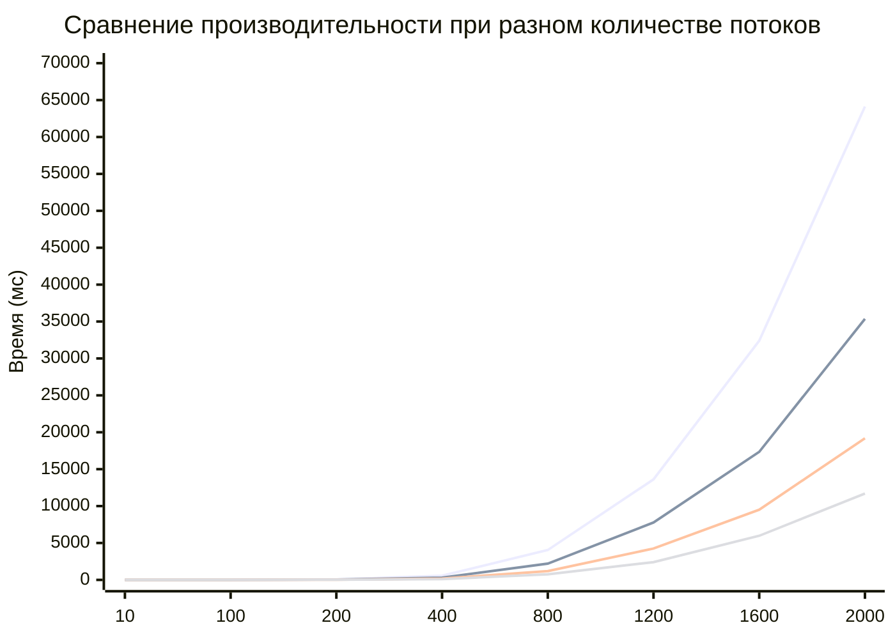

# Лабараторная работа №2 студента группы 6213 Болдырева Дениса:

**Исходная точка программы - lab2.cpp. Записывает исходные матрицы в begin.cpp и результат в end.cpp. Верификация - verify.py, выполняется автоматически при указании верного пути к python.exe.**

## Таблица измерений

| № замера | Размер матрицы | Время перемножения, мс |
|:----------:|:----------------:|:------------------------:|
|**Число потоков - 1**|
| 1.1 | 10 | 0.018 |
| 1.2 | 100 | 7.855 |
| 1.3 | 200 | 70.48 |
| 1.4 | 400 | 561.609 |
| 1.5 | 800 | 4044.55 |
| 1.6 | 1200 | 13617.9 |
| 1.7 | 1600 | 32394.6 |
| 1.8 | 2000 | 64124.5 |
|**Число потоков - 2**|
| 2.1 | 10 | 0.117 |
| 2.2 | 100 | 6.592 |
| 2.3 | 200 | 42.047 |
| 2.4 | 400 | 304.151 |
| 2.5 | 800 | 2207.14 |
| 2.6 | 1200 | 7777.86 |
| 2.7 | 1600 | 17346.8 |
| 2.8 | 2000 | 35365.7 |
|**Число потоков - 4**|
| 3.1 | 10 | 0.296 |
| 3.2 | 100 | 4.193 |
| 3.3 | 200 | 25.253 |
| 3.4 | 400 | 178.805 |
| 3.5 | 800 | 1196.21 |
| 3.6 | 1200 | 4252.53 |
| 3.7 | 1600 | 9510.51 |
| 3.8 | 2000 | 19181.1 |
|**Число потоков - 8**|
| 4.1 | 10 | 0.962 |
| 4.2 | 100 | 3.148 |
| 4.3 | 200 | 15.51 |
| 4.4 | 400 | 99.027 |
| 4.5 | 800 | 758.1 |
| 4.6 | 1200 | 2406.17 |
| 4.7 | 1600 | 5974.68 |
| 4.8 | 2000 | 11695.9 |

### График: Зависимость времени от размера матрицы и количества потоков

