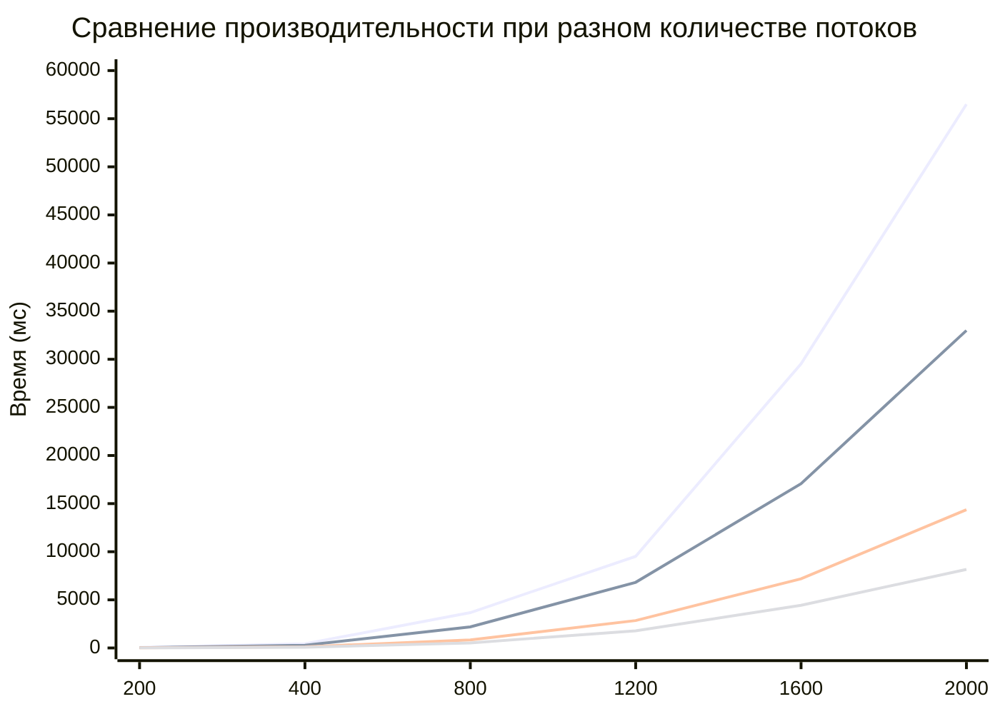

# Лабараторная работа №3 студента группы 6213 Болдырева Дениса:

**Исходная точка программы - run.bat. Записывает исходные матрицы в begin.txt и результат в end.txt. Верификация - verify.py, выполняется автоматически при указании верного пути к python.exe.**

## Таблица измерений (число ядер - 8)

| № замера | Размер матрицы | Время перемножения, мс |
|:----------:|:----------------:|:------------------------:|
|**Число потоков - 1**|
| 1.1 | 10 | 0.031 |
| 1.2 | 100 | 7.271 |
| 1.3 | 200 | 53.946 |
| 1.4 | 400 | 431.437 |
| 1.5 | 800 | 3672.07 |
| 1.6 | 1200 | 9517.4 |
| 1.7 | 1600 | 29531.4 |
| 1.8 | 2000 | 56502.2 |
|**Число потоков - 2**|
| 2.1 | 10 | 0.93 |
| 2.2 | 100 | 4.083 |
| 2.3 | 200 | 28.145 |
| 2.4 | 400 | 273.567 |
| 2.5 | 800 | 2186.47 |
| 2.6 | 1200 | 6821.97 |
| 2.7 | 1600 | 17071.1 |
| 2.8 | 2000 | 32993.3 |
|**Число потоков - 4**|
| 3.1 | 10 | - |
| 3.2 | 100 | 3.618 |
| 3.3 | 200 | 16.83 |
| 3.4 | 400 | 120.177 |
| 3.5 | 800 | 839.869 |
| 3.6 | 1200 | 2849.05 |
| 3.7 | 1600 | 7185.09 |
| 3.8 | 2000 | 14370.1 |
|**Число потоков - 8**|
| 4.1 | 10 | - |
| 4.2 | 100 | - |
| 4.3 | 200 | 9.352 |
| 4.4 | 400 | 81.763 |
| 4.5 | 800 | 525.234 |
| 4.6 | 1200 | 1779.83 |
| 4.7 | 1600 | 4433.23 |
| 4.8 | 2000 | 8164.45 |

### График: Зависимость времени от размера матрицы и количества потоков

**Вывод: наибольший прирост производительности MPI показало при увеличении потоков с 2 на 4. По сравнению с OpenMP выросла скоростб, но также появились дополнительные трудности: утяжеление написания кода, трудности с запуском программы (запуск с параметрами командной строки и как следствие ручное разделение сборки (для изменения размера матриц) и запуска программы или же создание .bat файла и запуск через него), а также для матриц от 1600 пришлось увеличить размер стека до 128 мб.**

*Примечание: для 4 и 8 потоков не удалось провести исследования на некоторых малых размерах матрицы, так как не было полного разделения на потоки. Однако все размеры указанные в задании были рассмотрены а также на малых размерах эффект от распараллеливания и изменения количества потоков не так заметен.*
